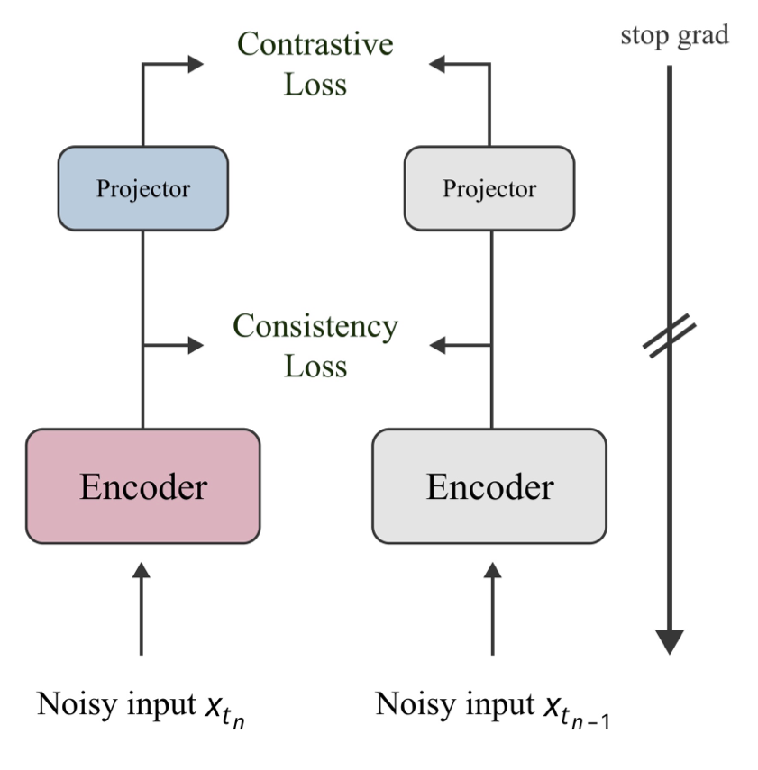
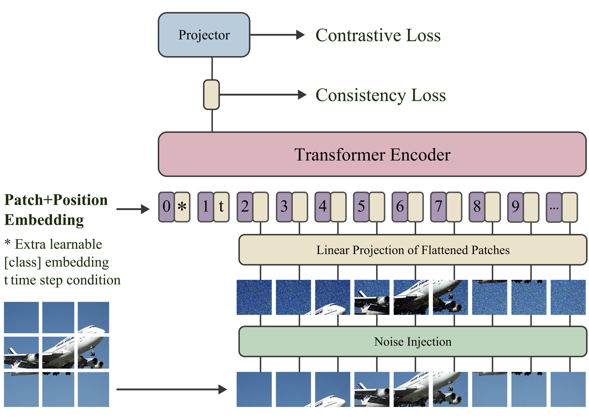

<h1 align="center">Robust Representation Consistency Model via Contrastive Denoising</h1>
<div align="center">

[](https://arxiv.org/abs/2501.13094)&nbsp;

  <a href="https://jiachenlei.github.io/" target="_blank">Jiachen&nbsp;Lei</a><sup>1,5</sup> &ensp; <b>&middot;</b> &ensp;
  <a href="https://jberner.info" target="_blank">Julius Berner</a><sup>2</sup> &ensp; <b>&middot;</b> &ensp;
  <a href="https://jiongxiao-wang.github.io" target="_blank">Jiongxiao Wang</a><sup>3</sup> &ensp; <b>&middot;</b> &ensp;
  <a href="https://sites.google.com/umich.edu/zhongzhc/home" target="_blank">Zhongzhu Chen</a><sup>4</sup>
  <br>
  Zhongjie Ba<sup>1</sup> &ensp; <b>&middot;</b> &ensp;
  Kui Ren<sup>1</sup>&ensp; <b>&middot;</b> &ensp;
  <a href="https://ml.cs.tsinghua.edu.cn/~jun/index.shtml" target="_blank">Jun Zhu</a><sup>5,6</sup>&ensp; <b>&middot;</b> &ensp;
  <a href="http://tensorlab.cms.caltech.edu/users/anima/" target="_blank">Anima Anandkumar</a><sup>2</sup>
  <br>
  <sup>1</sup> Zhejiang University &emsp; <sup>2</sup>Caltech&emsp; <sup>3</sup> UW-Madison &emsp; <sup>4</sup>Amazon&emsp; <sup>5</sup>Shengshu Tech&emsp; <sup>6</sup>Tsinghua University&emsp;<br>
</div><br>


<p align="center">


</p>


### :fire: TODO
- [ ] Upload Pre-trained Weights

### Requirements
```
pip install -r requirements.txt
```


### Data Pre-processing
- the ImageNet dataset should be downloaded and organized as follows:  
imagenet directory  
    - train/
        - n01440764
            - *.JPEG
        - ...
    - val/
        - n01440764
            - *.JPEG
        - ...
- the CIFAR10 dataset should be downloaded and organized following the official way provided by pytorch. (We read CIFAR10 images using torchvision)

### Pre-Training
#### ImageNet
```python
# RCM-B: train on 4 8xGPU machines
# run the following command on each machine while modifying the machine rank from 0 to 3
accelerate launch --num_processes 32 --num_machines 4 --machine_rank $1 train.py --config=configs/imagenet_pretrain_rcmb.py --workdir=[path to save logs/ckpts] --config.dataset.data_dir="path to train/"

# RCM-S: rain on 2 8xGPU machines
# run the following command on each machine while modifying the machine rank from 0 to 1
accelerate launch --num_processes 16 --num_machines 2 --machine_rank $1 train.py --config=configs/imagenet_pretrain_rcms.py --workdir=[path to save logs/ckpts] --config.dataset.data_dir="path to train/"
```

#### CIFAR10
```python
# RCM-B: train on 1 8xGPU machines
# run the following command on each machine while modifying the machine rank from 0 to 3
accelerate launch --num_processes 8 train.py --config=configs/cifar10_pretrain.py --workdir=[path to save logs/ckpts] --config.dataset.data_dir="path to cifar10 folder"
```

### Fine-tuning
Noticeably, we add noise to normalized data. Therefore, to align with 

#### ImageNet
```python
# Fine-tune RCM-B at sigma=0.25
accelerate launch --num_processes 8 --mixed_precision no rcm_tune.py \
    --config=configs/imagenet_finetune.py \
        --task=consistency \
        --eta=0.5 \
        --lbd=10.0 \
        --noise_aug=0.5 \
        --path "path to pre-trained .net ckpt" \
        --config.train.epochs=150 \
        --config.train.layernorm=True \
        --config.optimizer.lr_layer_decay=0.65 \
        --config.optimizer.name="adamw" \
        --config.optimizer.param.lr=2e-4 \
        --config.optimizer.param.weight_decay=0.0 \
        --config.dataset.batch_size=1024 \
        --config.dataset.augmentation_type="autoaug" \
        --config.dataset.mixup=0.8 \
        --config.dataset.cutmix=1.0 \
        --config.dataset.label_smoothing=0.1 \
        --config.dataset.mixup_switch_prob=0.5 \
        --config.nnet.hidden_dim=4096 \
        --config.dataset.data_dir="path to directory that contains train/ and val/ folders" \
        --name="name of directory that saves the experiment results, including logs and ckpts"

# Fine-tune RCM-B at sigma=0.5
accelerate launch --num_processes 8 --mixed_precision no rcm_tune.py \
    --config=configs/imagenet_finetune.py \
        --task=consistency \
        --eta=0.5 \
        --lbd=20.0 \
        --noise_aug=1.0 \
        --path "path to pre-trained .net ckpt" \
        --config.train.epochs=50 \
        --config.train.layernorm=True \
        --config.optimizer.lr_layer_decay=0.65 \
        --config.optimizer.name="adamw" \
        --config.optimizer.param.lr=2e-4 \
        --config.optimizer.param.weight_decay=0.0 \
        --config.dataset.batch_size=2048 \
        --config.dataset.augmentation_type="strong" \
        --config.dataset.mixup=0.8 \
        --config.dataset.cutmix=1.0 \
        --config.dataset.mixup_switch_prob=0.5 \
        --config.dataset.label_smoothing=0.0 \
        --config.nnet.hidden_dim=4096 \
        --config.dataset.data_dir="path to directory that contains train/ and val/ folders" \
        --name="name of directory that saves the experiment results, including logs and ckpts"


# Fine-tune RCM-B at sigma=1.0
accelerate launch --num_processes 8 --mixed_precision no rcm_tune.py \
    --config=configs/imagenet_finetune.py \
        --task=consistency \
        --eta=0.5 \
        --lbd=20.0 \
        --noise_aug=2.0 \
        --path "path to pre-trained .net ckpt" \
        --config.train.epochs=150 \
        --config.train.layernorm=True \
        --config.optimizer.lr_layer_decay=0.65 \
        --config.optimizer.name="adamw" \
        --config.optimizer.param.lr=1e-4 \
        --config.optimizer.param.weight_decay=0.0 \
        --config.dataset.batch_size=256 \
        --config.dataset.augmentation_type="weak" \
        --config.dataset.mixup=0.8 \
        --config.dataset.cutmix=1.0 \
        --config.dataset.mixup_switch_prob=0.5 \
        --config.dataset.label_smoothing=0.0 \
        --config.nnet.hidden_dim=4096 \
        --config.dataset.data_dir="path to directory that contains train/ and val/ folders" \
        --name="name of directory that saves the experiment results, including logs and ckpts"

```

#### CIFAR10

```python
# Fine-tune RCM-B at sigma=0.25
accelerate launch --num_processes 8 --mixed_precision no rcm_tune.py \
    --config=configs/cifar10_finetune.py \
        --task=consistency \
        --eta=0.5 \
        --lbd=10.0 \
        --noise_aug=0.5 \
        --path "path to pre-trained .net ckpt" \
        --config.train.epochs=100 \
        --config.train.layernorm=False \
        --config.optimizer.lr_layer_decay=0.75 \
        --config.optimizer.name="adamw" \
        --config.optimizer.param.lr=2e-4 \
        --config.optimizer.param.weight_decay=0.0 \
        --config.dataset.batch_size=1024 \
        --config.dataset.augmentation_type="weak" \
        --config.dataset.mixup=0.0 \
        --config.dataset.cutmix=0.0 \
        --config.dataset.label_smoothing=0.0 \
        --config.dataset.data_dir="path to training images" \
        --name="name of directory that saves the experiment results, including logs and ckpts"

# Fine-tune RCM-B at sigma=0.5
accelerate launch --num_processes 8 --mixed_precision no rcm_tune.py \
    --config=configs/cifar10_finetune.py \
        --task=consistency \
        --eta=0.5 \
        --lbd=20.0 \
        --noise_aug=1.0 \
        --path "path to pre-trained .net ckpt" \
        --config.train.epochs=100 \
        --config.train.layernorm=False \
        --config.optimizer.lr_layer_decay=0.75 \
        --config.optimizer.name="adamw" \
        --config.optimizer.param.lr=2e-4 \
        --config.optimizer.param.weight_decay=0.0 \
        --config.dataset.batch_size=1024 \
        --config.dataset.augmentation_type="weak" \
        --config.dataset.mixup=0.0 \
        --config.dataset.cutmix=0.0 \
        --config.dataset.label_smoothing=0.0 \
        --config.dataset.data_dir="path to training images" \
        --name="name of directory that saves the experiment results, including logs and ckpts"

# Fine-tune RCM-B at sigma=1.0
accelerate launch --num_processes 8 --mixed_precision no rcm_tune.py \
    --config=configs/cifar10_finetune.py \
        --task=consistency \
        --eta=0.5 \
        --lbd=20.0 \
        --noise_aug=2.0 \
        --path "path to pre-trained .net ckpt" \
        --config.train.epochs=100 \
        --config.train.layernorm=False \
        --config.optimizer.lr_layer_decay=0.65 \
        --config.optimizer.name="adamw" \
        --config.optimizer.param.lr=2e-4 \
        --config.optimizer.param.weight_decay=0.0 \
        --config.dataset.batch_size=1024 \
        --config.dataset.augmentation_type="weak" \
        --config.dataset.mixup=0.0 \
        --config.dataset.cutmix=0.0 \
        --config.dataset.label_smoothing=0.0 \
        --config.dataset.data_dir="path to training images" \
        --name="name of directory that saves the experiment results, including logs and ckpts"

```

### Certification
```python
# At noise level [0.25, 0.5, 1.0],, certify RCM-B, pre-trained on Imagenet for 600k steps, with 100k smoothing noise
python certify.py --config=configs/imagenet_finetune.py --n=100000 --step=600000 --path="PATH TO .net file" --name="name of directory for saving the certification results" --config.train.layernorm=True --config.dataset.data_dir="path to the directory that contains train/ and val/ folders"

# At noise level [0.25, 0.5, 1.0], certify RCM-B, pre-trained on CIFAR10 for 300k steps, with 100k smoothing noise
python certify.py --config=configs/cifar10_finetune.py --n=100000 --step=300000 --path="PATH TO .net file" --name="name of directory for saving the certification results" --config.train.layernorm=False --config.dataset.data_dir="path to the dataset directory"
```

## Citation
```bibtex
@misc{lei2025robustrepresentationconsistencymodel,
      title={Robust Representation Consistency Model via Contrastive Denoising}, 
      author={Jiachen Lei and Julius Berner and Jiongxiao Wang and Zhongzhu Chen and Zhongjia Ba and Kui Ren and Jun Zhu and Anima Anandkumar},
      year={2025},
      eprint={2501.13094},
      archivePrefix={arXiv},
      primaryClass={cs.CV},
      url={https://arxiv.org/abs/2501.13094}, 
}
```
